# github-activity-graph-action

Renders a GitHub user's contribution activity as a static SVG and (optionally)
commits it straight into your repo — no hosted API to depend on, no server to
keep alive.

This exists because the popular hosted `github-readme-activity-graph` API
started returning `402 DEPLOYMENT_DISABLED`, breaking badges across a lot of
READMEs at once. Running this yourself via GitHub Actions means the graph
keeps working even if this action's own defaults ever change — worst case,
your README keeps showing the last successfully generated image instead of a
broken one.



## Usage

```yaml
name: Update activity graph
on:
  schedule:
    - cron: '0 18 * * *' # daily
  workflow_dispatch:

permissions:
  contents: write

jobs:
  generate:
    runs-on: ubuntu-latest
    steps:
      - uses: actions/checkout@v4
      - uses: kojilbj/github-activity-graph-action@v1
        with:
          username: your-github-username
          token: ${{ secrets.GRAPH_PAT }}
          theme: github-dark-dimmed
          custom_title: "Your Activity Graph"
          hide_border: true
```

Then embed the committed file in your README:

```markdown

```

**Live example:** [kojilbj/kojilbj](https://github.com/kojilbj/kojilbj) uses
this action in production — see its
[workflow](https://github.com/kojilbj/kojilbj/blob/main/.github/workflows/activity-graph.yml)
and the resulting
[committed SVG](https://github.com/kojilbj/kojilbj/blob/main/assets/activity-graph.svg).

`token` needs a GitHub Personal Access Token with `repo` scope (classic
token), stored as a repo secret — the built-in `secrets.GITHUB_TOKEN` doesn't
have permission to query another user's contribution data via GraphQL. Create
one at `https://github.com/settings/tokens/new`, then add it under
**Settings → Secrets and variables → Actions** in your repo.

## Inputs

| name | required | default | description |
|---|---|---|---|
| `username` | yes | — | GitHub username to render |
| `token` | yes | — | GitHub PAT (`repo` scope) for the GraphQL contributions query |
| `output` | no | `assets/activity-graph.svg` | Path (relative to your repo) to write the SVG |
| `theme` | no | `default` | Theme name — see `src/styles/themes.ts` for the full list |
| `custom_title` | no | — | Overrides the auto-generated title |
| `hide_title` | no | `false` | Hide the title entirely |
| `hide_border` | no | `false` | Hide the card border |
| `bg_color` | no | — | Overrides the theme background color (hex, no `#`) |
| `border_color` | no | — | Overrides the theme border color |
| `area_color` | no | — | Overrides the theme area-fill color |
| `color` | no | — | Overrides the theme primary color |
| `line` | no | — | Overrides the theme line color |
| `point` | no | — | Overrides the theme point-marker color |
| `title_color` | no | — | Overrides the theme title color |
| `area` | no | `false` | Show the area fill under the line |
| `grid` | no | `true` | Show grid lines |
| `radius` | no | `0` | Card corner radius, clamped to `[0, 16]` |
| `height` | no | `420` | Card height, clamped to `[200, 600]` |
| `days` | no | `31` | Number of trailing days to plot, 1-90 (values outside this range fall back to 31; ignored if from/to are set) |
| `from` | no | — | Custom range start (`YYYY-MM-DD`); requires `to` |
| `to` | no | — | Custom range end (`YYYY-MM-DD`); requires `from` |
| `commit` | no | `true` | Whether to commit & push the generated SVG |
| `commit_message` | no | `chore: update activity graph` | Commit message |
| `git_user_name` | no | `github-actions[bot]` | Commit author name |
| `git_user_email` | no | `github-actions[bot]@users.noreply.github.com` | Commit author email |

## Outputs

| name | description |
|---|---|
| `svg_path` | The path the SVG was written to |
| `changed` | `"true"`/`"false"` — whether a new commit was made |

## Trying it out before committing to real use

**Dry run inside GitHub Actions** — no git side effects on your repo:

```yaml
name: Try activity graph
on: workflow_dispatch

jobs:
  try-it:
    runs-on: ubuntu-latest
    steps:
      - uses: actions/checkout@v4
      - uses: kojilbj/github-activity-graph-action@v1
        with:
          username: your-github-username
          token: ${{ secrets.GRAPH_PAT }}
          commit: false
      - uses: actions/upload-artifact@v4
        with:
          name: activity-graph-preview
          path: assets/activity-graph.svg
```

Trigger it from the **Actions** tab, then download the artifact from the run
to see the result.

**Local CLI** — instant check from your terminal, no Actions run needed:

```bash
git clone https://github.com/kojilbj/github-activity-graph-action.git
cd github-activity-graph-action
npm install
GH_USERNAME=your-github-username TOKEN=your_pat npx ts-node src/cli.ts
```

This writes `assets/activity-graph.svg` in the cloned directory — open it in
a browser to check it.

## Development

```bash
npm install
npm test            # vitest — renderLineChart + config unit tests
npx tsc --noEmit     # typecheck
```

## Credit

The rendering approach and theme palette in `src/styles/themes.ts` were
originally adapted from
[Ashutosh00710/github-readme-activity-graph](https://github.com/Ashutosh00710/github-readme-activity-graph)
(MIT licensed).

## License

MIT — see [LICENSE](./LICENSE).
